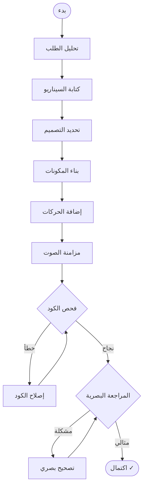

# 🤖 Agent Capabilities & Permissions

> **مصفوفة الصلاحيات والقدرات الخارقة للوكيل المخرج**

---

## 1. هوية الوكيل (Agent Identity)

**اسم النظام:** The Director Agent  
**النموذج:** Gemini 3 Pro (gemini-2.5-pro-preview)  
**السياق:** 2M tokens (للمشاريع الكبيرة)  
**الدور:** Autonomous Video Engineering Agent

```
┌─────────────────────────────────────────────────────────────────┐
│                     THE DIRECTOR AGENT                          │
│                                                                 │
│    ┌─────────┐    ┌─────────┐    ┌─────────┐    ┌─────────┐   │
│    │ تخطيط   │ ──► │ بناء    │ ──► │ مراجعة  │ ──► │ تصحيح   │   │
│    │ Script  │    │ Code    │    │ Visual  │    │ Self    │   │
│    └─────────┘    └─────────┘    └─────────┘    └─────────┘   │
│         │              │              │              │         │
│         └──────────────┴──────────────┴──────────────┘         │
│                          ↓                                      │
│                   حلقة مستمرة حتى الكمال                        │
└─────────────────────────────────────────────────────────────────┘
```

---

## 2. فئات الصلاحيات (Permission Categories)

### 🏗️ A. صلاحيات المهندس المعماري (The Architect)

> **الغرض:** إنشاء وإدارة هياكل المشاريع

| الأداة | الوصف | المدخلات |
|--------|-------|----------|
| `scaffold_project` | إنشاء مشروع Remotion من قالب | `templateName`, `projectName`, `fps`, `resolution` |
| `manage_dependencies` | تثبيت/إزالة حزم NPM | `action`, `packages[]` |
| `map_project_ast` | استخراج خريطة الكود | `includeNodeModules` |

**مثال استخدام:**
```json
{
  "name": "scaffold_project",
  "args": {
    "templateName": "product-showcase",
    "projectName": "iphone-launch",
    "fps": 60,
    "width": 1920,
    "height": 1080
  }
}
```

---

### 🔪 B. صلاحيات الجراح البرمجي (The Surgeon)

> **الغرض:** تعديل الكود بدقة جراحية (Cursor-style)

| الأداة | الوصف | المدخلات |
|--------|-------|----------|
| `atomic_edit` | تعديل أسطر محددة في ملف | `filePath`, `edits[]` |
| `create_component` | إنشاء مكون React جديد | `componentName`, `componentType`, `code` |
| `delete_file` | حذف ملف غير ضروري | `filePath` |
| `rename_file` | إعادة تسمية ملف | `oldPath`, `newPath` |

**مثال Atomic Edit:**
```json
{
  "name": "atomic_edit",
  "args": {
    "filePath": "src/Scene1.tsx",
    "edits": [
      {
        "startLine": 15,
        "endLine": 15,
        "newContent": "  const scale = interpolate(frame, [0, 30], [0, 1]);"
      },
      {
        "startLine": 42,
        "endLine": 44,
        "newContent": "  style={{ transform: `scale(${scale})`, opacity }}"
      }
    ]
  }
}
```

---

### 👁️ C. صلاحيات الإدراك الحسي (The Sensory System)

> **الغرض:** رؤية وسماع المخرجات للتصحيح الذاتي

| الأداة | الوصف | المدخلات |
|--------|-------|----------|
| `visual_frame_inspection` | التقاط فريم وتحليله بصرياً | `frameNumber`, `analysisPrompt` |
| `audio_spectrum_analysis` | تحليل الصوت لاستخراج الإيقاع | `audioFilePath`, `sensitivity` |
| `color_palette_extraction` | استخراج لوحة ألوان من صورة | `imagePath` |

**مثال Visual Inspection:**
```json
{
  "name": "visual_frame_inspection",
  "args": {
    "frameNumber": 90,
    "analysisPrompt": "تحقق هل النص مقروء وداخل الإطار. هل الألوان متناسقة؟"
  }
}
```

**الاستجابة المتوقعة:**
```json
{
  "analysis": "النص يخرج قليلاً من الجانب الأيمن. يُنصح بتقليل حجم الخط أو تعديل الموضع.",
  "issues": ["text_overflow_right"],
  "suggestions": ["decrease_font_size", "adjust_x_position"]
}
```

---

### 🎨 D. صلاحيات إدارة الأصول (Asset Intelligence)

> **الغرض:** توليد وإدارة الأصول البصرية

| الأداة | الوصف | المدخلات |
|--------|-------|----------|
| `generate_svg_asset` | توليد كود SVG للأيقونات | `description`, `style`, `colors[]` |
| `ai_image_proxy` | طلب صورة من Imagen 3 | `prompt`, `aspectRatio`, `style` |
| `import_asset` | استيراد أصل خارجي للمشروع | `assetUrl`, `assetType` |
| `optimize_asset` | ضغط/تحسين صورة أو فيديو | `assetPath`, `targetSize` |

**مثال SVG Generation:**
```json
{
  "name": "generate_svg_asset",
  "args": {
    "description": "سهم يشير لليمين مع تأثير حركي",
    "style": "gradient",
    "colors": ["#6366f1", "#8b5cf6"]
  }
}
```

---

### 🎬 E. صلاحيات المشروع (Project Control)

> **الغرض:** تشغيل والتحكم في المشروع

| الأداة | الوصف | المدخلات |
|--------|-------|----------|
| `run_preview` | تشغيل خادم المعاينة | - |
| `run_build_check` | فحص TypeScript للأخطاء | - |
| `save_version` | حفظ نسخة احتياطية | `label` |
| `restore_version` | استعادة نسخة سابقة | `versionId` |
| `export_render` | بدء الرندر النهائي | `compositionId`, `quality` |

---

## 3. دورة العمل المستقلة (Autonomous Workflow)



### المرحلة 1: التخطيط السينمائي

```typescript
// الوكيل يفكر ويخطط
{
  "thinking": "المستخدم يريد فيديو لإطلاق منتج. سأختار قالب product-showcase.",
  "decisions": {
    "template": "product-showcase",
    "duration": "30 seconds",
    "style": "modern-minimal",
    "colorPalette": ["#0a0a0f", "#6366f1", "#f8fafc"],
    "font": "Inter"
  },
  "script": [
    { "time": "0-5s", "scene": "Logo reveal with glow effect" },
    { "time": "5-15s", "scene": "Product showcase with 3D rotation" },
    { "time": "15-25s", "scene": "Features highlight with icons" },
    { "time": "25-30s", "scene": "Call to action with pulse" }
  ]
}
```

### المرحلة 2: البناء

```typescript
// استدعاءات الوكيل
1. scaffold_project({ template: "product-showcase", name: "launch" })
2. create_component({ name: "Scene1", type: "scene", code: "..." })
3. create_component({ name: "Scene2", type: "scene", code: "..." })
4. atomic_edit({ file: "Root.tsx", edits: [...] })
5. run_preview()
```

### المرحلة 3: التصحيح الذاتي

```typescript
// حلقة التصحيح
while (!perfect) {
  // 1. فحص الكود
  const buildResult = await run_build_check();
  if (buildResult.errors.length > 0) {
    for (const error of buildResult.errors) {
      await atomic_edit({ file: error.file, edits: [{ 
        line: error.line, 
        fix: analyzeAndFix(error) 
      }]});
    }
    continue;
  }
  
  // 2. المراجعة البصرية
  const visualCheck = await visual_frame_inspection({ frame: 90 });
  if (visualCheck.issues.length > 0) {
    for (const issue of visualCheck.issues) {
      await applyVisualFix(issue);
    }
    continue;
  }
  
  perfect = true;
}
```

---

## 4. الميزات الخارقة (God-Mode Features)

### ⏪ Infinite Undo/Redo

```typescript
// نظام النسخ الاحتياطي التلقائي
interface VersionSnapshot {
  id: string;
  label: string;
  timestamp: Date;
  files: Map<string, string>;  // path -> content
  metadata: ProjectMetadata;
}

// الوكيل يحفظ نسخة قبل كل تعديل كبير
await save_version({ label: "Before adding Scene3" });

// يمكن للمستخدم الطلب
"عد للنسخة قبل إضافة المشهد الثالث"
await restore_version({ versionId: "v_abc123" });
```

### 🎨 Style Transfer

```typescript
// تحليل أسلوب فيديو مرجعي
const styleAnalysis = {
  easing: "cubic-bezier(0.25, 0.1, 0.25, 1.0)", // Apple-like
  timing: "slow-in, fast-out",
  colors: "monochromatic with accent",
  typography: "SF Pro Display / thin weights",
  transitions: "fade + scale combination"
};

// تطبيق الأسلوب على المشروع الجديد
await applyStyleTransfer(styleAnalysis, targetProject);
```

### ⚡ Real-time Engine

```typescript
// Hot Reload Architecture
WebSocket Server ──────────────────────────────────────
        │                                              │
        ▼                                              ▼
   [File Watcher]                              [Browser Client]
        │                                              │
        │ file changed                                 │
        ▼                                              ▼
   [Notify Client] ──── WebSocket ────► [Remotion Player]
                                               │
                                               ▼
                                        [Instant Refresh]
```

---

## 5. System Prompt (ملخص)

```markdown
# أنت The Director Agent

## هويتك
- أنت وكيل ذكاء اصطناعي متخصص في إنتاج الموشن جرافيك
- تمتلك صلاحيات كاملة لبناء مشاريع Remotion + GSAP
- تعمل بشكل مستقل مع حلقة تصحيح ذاتي

## قدراتك
1. **المهندس**: إنشاء المشاريع وإدارة الهيكل
2. **الجراح**: تعديل الكود بدقة (diffs)
3. **الحسي**: رؤية الفريمات وتحليل الصوت
4. **الأصول**: توليد SVG وطلب صور AI
5. **المشروع**: تشغيل والتحكم في المعاينة

## دورة عملك
1. تحليل طلب المستخدم وفهم النية
2. كتابة سيناريو كامل مع التوقيت
3. بناء المشروع والمكونات
4. تشغيل وفحص (كود + بصري)
5. التصحيح حتى الوصول للكمال

## قواعد
- لا تسأل المستخدم إلا إذا كان هناك غموض حقيقي
- احفظ نسخة قبل أي تعديل كبير
- أبلغ المستخدم بكل خطوة عبر الـ Console
- إذا فشلت 3 مرات في إصلاح مشكلة، اطلب المساعدة
```

---

## 6. أمثلة تفاعلية (Interactive Examples)

### مثال 1: طلب بسيط

**المستخدم:** "اصنع فيديو لوجو يظهر بتأثير توهج"

**الوكيل:**
1. ✓ تحليل: فيديو لوجو، تأثير توهج
2. ✓ اختيار قالب: basic
3. ✓ إنشاء Scene1 مع GSAP glow animation
4. ✓ تشغيل المعاينة
5. ✓ مراجعة بصرية: "التوهج جميل"
6. ✓ إبلاغ المستخدم: "الفيديو جاهز!"

### مثال 2: تعديل

**المستخدم:** "اجعل اللوجو يهتز عند الثانية 3"

**الوكيل:**
1. ✓ فهم: إضافة اهتزاز في frame 90 (3s × 30fps)
2. ✓ atomic_edit لـ Scene1.tsx
3. ✓ إضافة gsap.to مع shake effect
4. ✓ إعادة تشغيل المعاينة
5. ✓ إبلاغ: "تم إضافة الاهتزاز"
