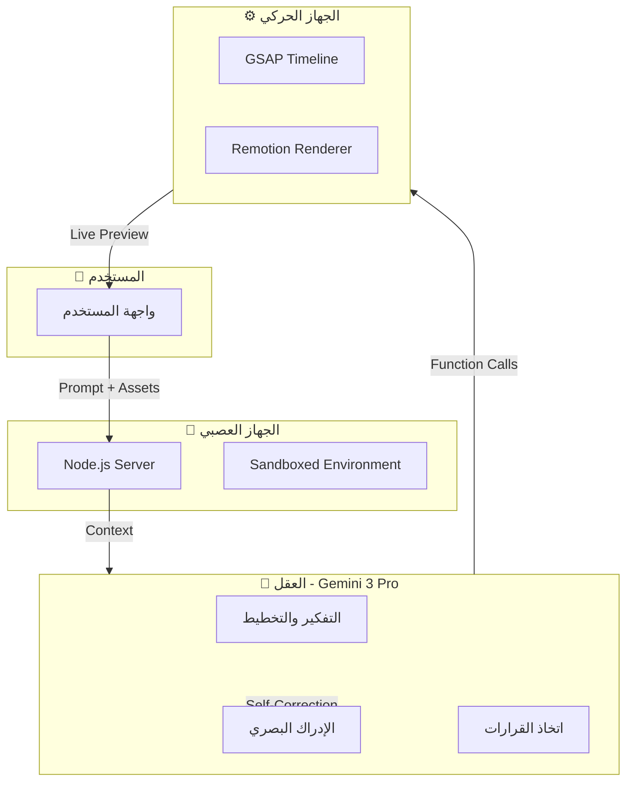
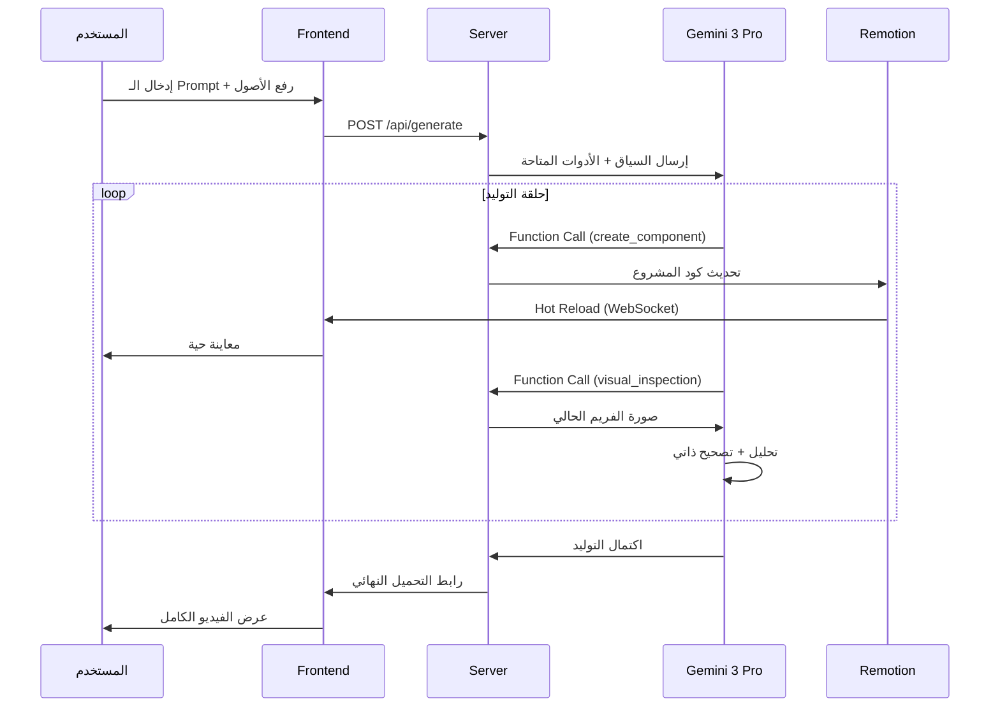
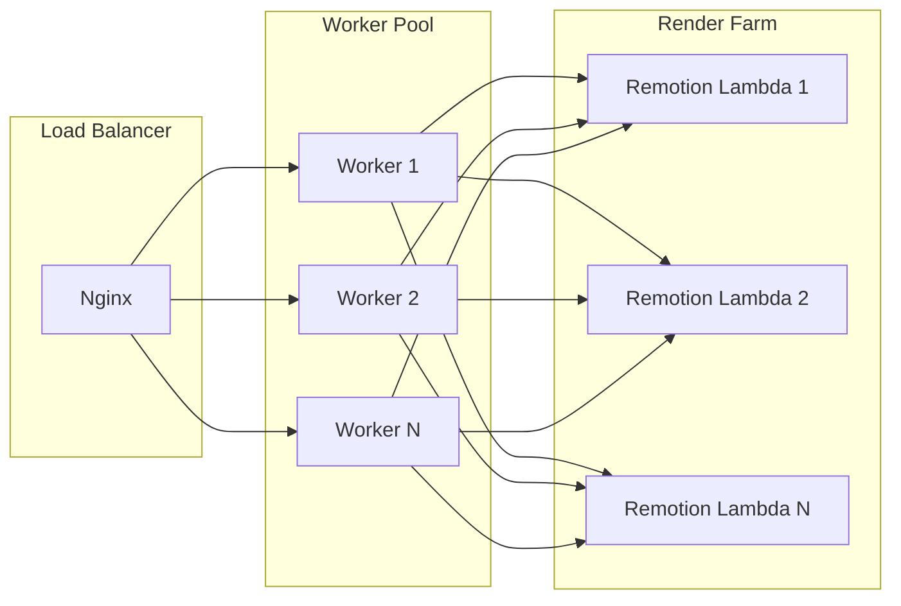

# 🎬 The Director Agent - System Architecture

> **مخطط النظام الشامل لوكيل الموشن جرافيك الذكي**

---

## 1. الرؤية التقنية (Technical Vision)



---

## 2. المكونات الأساسية (Core Components)

| المكون | الدور | التقنية |
|--------|-------|---------|
| **العقل** | التفكير، التخطيط، توليد الكود | Gemini 3 Pro (2M context window) |
| **الجهاز الحركي** | تنفيذ الحركات والرندر | GSAP + Remotion |
| **الجهاز العصبي** | إدارة الصلاحيات والملفات | Node.js + Express |
| **الذاكرة** | السياق والتعلم | Redis + Vector DB |

---

## 3. طبقات النظام (System Layers)

### Layer 1: Presentation Layer (طبقة العرض)
- **Next.js 15** App Router
- **Shadcn UI** + Tailwind CSS (Dark Mode)
- **Framer Motion** للحركات الانتقالية
- **Socket.io Client** للتحديثات الفورية

### Layer 2: Communication Layer (طبقة الاتصال)
- **REST API** للعمليات العادية
- **WebSocket** للـ Streaming والتحديثات الحية
- **Server-Sent Events** لسجل التفكير

### Layer 3: Agent Core Layer (طبقة الوكيل)
- **Gemini 3 Pro SDK** مع Function Calling
- **Tool Registry** لإدارة الصلاحيات
- **Memory Manager** للسياق المتعدد الطبقات

### Layer 4: Execution Layer (طبقة التنفيذ)
- **Remotion Bundler** لبناء الفيديو
- **GSAP Engine** للحركات
- **Asset Pipeline** لإدارة الأصول

### Layer 5: Persistence Layer (طبقة الحفظ)
- **PostgreSQL** للبيانات الرئيسية
- **Redis** للـ Session والـ Cache
- **S3/Cloudflare R2** للأصول والفيديوهات

---

## 4. تدفق البيانات (Data Flow)



---

## 5. بنية الأمان (Security Architecture)

### Sandbox Environment
```
┌─────────────────────────────────────────┐
│           Docker Container              │
│  ┌───────────────────────────────────┐  │
│  │     Agent Workspace (Isolated)    │  │
│  │  ┌─────────┐  ┌─────────────────┐ │  │
│  │  │ Remotion│  │ Generated Code  │ │  │
│  │  │ Project │  │    (Scoped)     │ │  │
│  │  └─────────┘  └─────────────────┘ │  │
│  └───────────────────────────────────┘  │
│              ↓ Controlled Access ↓       │
│  ┌───────────────────────────────────┐  │
│  │         Host File System          │  │
│  │    (Read-only for templates)      │  │
│  └───────────────────────────────────┘  │
└─────────────────────────────────────────┘
```

### Permission Boundaries
- **الوكيل** لا يملك وصولاً مباشراً لنظام الملفات الرئيسي
- كل مشروع في **حاوية معزولة**
- **Rate Limiting** على استدعاءات Function Calling
- **Audit Logging** لكل عملية

---

## 6. قابلية التوسع (Scalability)



- **Horizontal Scaling** للـ Workers
- **Remotion Lambda** للرندر الموزع
- **Queue System** (Bull/BullMQ) لإدارة الطلبات
